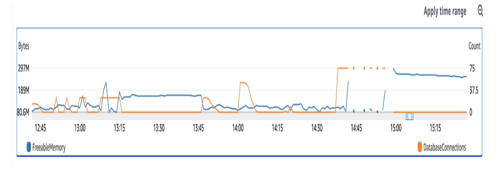
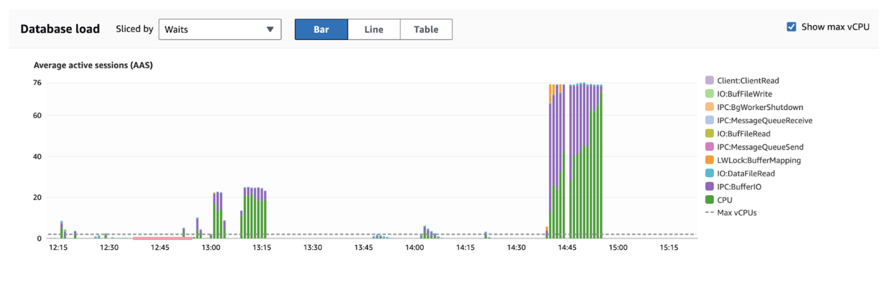

## pgbench custom scripts for high concurrent HashAggregate operation - exhaust CPU and memory usage is not significantly impacted!


## Overview 


The following pgbench tests were run over a several hour window
* each of the test is running a sql file (e.g. c70-med.sql,  c99-large.sql, c30-small.sql ...) which triggers a HashAggregate operation
* I was testing with different settings for hash_mem_multiplier (1,2,3,4)
* for c30-small.sql this is always in memory even with hash_mem_multiplier=1
* for c99-large.sql this is always goes to disc upto hash_mem_multiplier=4
* there is a sleep function to stagger the executions (a more realistic scenario)
* many of the tests are extremely short (-t 5 means 5 execs of the .sql script)
* with 75 concurrent connections and just 5 execs, we crash the server through CPU exhaustion - memory usage is not significantly impacted!

## Details 


```
Davids-MacBook-Pro:pgday-munich-work_mem davidpitts$ grep ec2-user docs/pgbench-hashagg.log | grep pgbench
[ec2-user@ip-172-31-27-58 ~]$ pgbench -c 10 -t 5  --host=pg15-test.cnwkiegakscs.eu-north-1.rds.amazonaws.com --port=5432 -U davep_aws_pg  -d postgres -f c70-med.sql
[ec2-user@ip-172-31-27-58 ~]$ pgbench -c 10 -t 5  --host=pg15-test.cnwkiegakscs.eu-north-1.rds.amazonaws.com --port=5432 -U davep_aws_pg  -d postgres -f c30-small.sql
[ec2-user@ip-172-31-27-58 ~]$ pgbench -c 3 -t 5  --host=pg15-test.cnwkiegakscs.eu-north-1.rds.amazonaws.com --port=5432 -U davep_aws_pg  -d postgres -f c30-small.sql
[ec2-user@ip-172-31-27-58 ~]$ pgbench -c 3 -t 5  --host=pg15-test.cnwkiegakscs.eu-north-1.rds.amazonaws.com --port=5432 -U davep_aws_pg  -d postgres -f c70-med.sql
[ec2-user@ip-172-31-27-58 ~]$ pgbench -c 3 -t 5  --host=pg15-test.cnwkiegakscs.eu-north-1.rds.amazonaws.com --port=5432 -U davep_aws_pg  -d postgres -f c70-med.sql
[ec2-user@ip-172-31-27-58 ~]$ pgbench -c 3 -t 5  --host=pg15-test.cnwkiegakscs.eu-north-1.rds.amazonaws.com --port=5432 -U davep_aws_pg  -d postgres -f c30-small.sql
[ec2-user@ip-172-31-27-58 ~]$ pgbench -c 10 -t 5  --host=pg15-test.cnwkiegakscs.eu-north-1.rds.amazonaws.com --port=5432 -U davep_aws_pg  -d postgres -f c30-small.sql
[ec2-user@ip-172-31-27-58 ~]$ pgbench -c 15 -t 3  --host=pg15-test.cnwkiegakscs.eu-north-1.rds.amazonaws.com --port=5432 -U davep_aws_pg  -d postgres -f c30-small.sql
[ec2-user@ip-172-31-27-58 ~]$ pgbench -c 15 -t 3  --host=pg15-test.cnwkiegakscs.eu-north-1.rds.amazonaws.com --port=5432 -U davep_aws_pg  -d postgres -f c30-small.sql ^C
[ec2-user@ip-172-31-27-58 ~]$ pgbench -c 25 -t 3  --host=pg15-test.cnwkiegakscs.eu-north-1.rds.amazonaws.com --port=5432 -U davep_aws_pg  -d postgres -f c50-med.sql
[ec2-user@ip-172-31-27-58 ~]$ pgbench -c 25 -t 6  --host=pg15-test.cnwkiegakscs.eu-north-1.rds.amazonaws.com --port=5432 -U davep_aws_pg  -d postgres -f c50-med.sql
[ec2-user@ip-172-31-27-58 ~]$ pgbench -c 25 -t 6  --host=pg15-test.cnwkiegakscs.eu-north-1.rds.amazonaws.com --port=5432 -U davep_aws_pg  -d postgres -f c50-med.sql
[ec2-user@ip-172-31-27-58 ~]$ # pgbench -c 25 -t 6  --host=pg15-test.cnwkiegakscs.eu-north-1.rds.amazonaws.com --port=5432 -U davep_aws_pg  -d postgres -f c50-med.sql
[ec2-user@ip-172-31-27-58 ~]$ # pgbench -c 25 -t 6  --host=pg15-test.cnwkiegakscs.eu-north-1.rds.amazonaws.com --port=5432 -U davep_aws_pg  -d postgres -f c50-med.sql
[ec2-user@ip-172-31-27-58 ~]$ pgbench -c 25 -t 6  --host=pg15-test.cnwkiegakscs.eu-north-1.rds.amazonaws.com --port=5432 -U davep_aws_pg  -d postgres -f c50-med.sql
[ec2-user@ip-172-31-27-58 ~]$ # pgbench -c 25 -t 6  --host=pg15-test.cnwkiegakscs.eu-north-1.rds.amazonaws.com --port=5432 -U davep_aws_pg  -d postgres -f c50-med.sql
[ec2-user@ip-172-31-27-58 ~]$ pgbench -c 25 -t 5  --host=pg15-test.cnwkiegakscs.eu-north-1.rds.amazonaws.com --port=5432 -U davep_aws_pg  -d postgres -f c50-med.sql
[ec2-user@ip-172-31-27-58 ~]$ # pgbench -c 25 -t 6  --host=pg15-test.cnwkiegakscs.eu-north-1.rds.amazonaws.com --port=5432 -U davep_aws_pg  -d postgres -f c50-med.sql
[ec2-user@ip-172-31-27-58 ~]$ # pgbench -c 25 -t 6  --host=pg15-test.cnwkiegakscs.eu-north-1.rds.amazonaws.com --port=5432 -U davep_aws_pg  -d postgres -f c50-med.sql
[ec2-user@ip-172-31-27-58 ~]$ # pgbench -c 25 -t 6  --host=pg15-test.cnwkiegakscs.eu-north-1.rds.amazonaws.com --port=5432 -U davep_aws_pg  -d postgres -f c50-med.sql
[ec2-user@ip-172-31-27-58 ~]$ # pgbench -c 25 -t 6  --host=pg15-test.cnwkiegakscs.eu-north-1.rds.amazonaws.com --port=5432 -U davep_aws_pg  -d postgres -f c50-med.sql
[ec2-user@ip-172-31-27-58 ~]$ # pgbench -c 25 -t 5  --host=pg15-test.cnwkiegakscs.eu-north-1.rds.amazonaws.com --port=5432 -U davep_aws_pg  -d postgres -f c50-med.sql
[ec2-user@ip-172-31-27-58 ~]$ pgbench -c 2 -t 5  --host=pg15-test.cnwkiegakscs.eu-north-1.rds.amazonaws.com --port=5432 -U davep_aws_pg  -d postgres -f c50-med.sql
[ec2-user@ip-172-31-27-58 ~]$ pgbench -c 50 -t 5  --host=pg15-test.cnwkiegakscs.eu-north-1.rds.amazonaws.com --port=5432 -U davep_aws_pg  -d postgres -f c50-med.sql
[ec2-user@ip-172-31-27-58 ~]$ pgbench -c 10 -t 5  --host=pg15-test.cnwkiegakscs.eu-north-1.rds.amazonaws.com --port=5432 -U davep_aws_pg  -d postgres -f c99-large.sql
[ec2-user@ip-172-31-27-58 ~]$ # pgbench -c 25 -t 6  --host=pg15-test.cnwkiegakscs.eu-north-1.rds.amazonaws.com --port=5432 -U davep_aws_pg  -d postgres -f c50-med.sql
[ec2-user@ip-172-31-27-58 ~]$ # pgbench -c 25 -t 6  --host=pg15-test.cnwkiegakscs.eu-north-1.rds.amazonaws.com --port=5432 -U davep_aws_pg  -d postgres -f c50-med.sql
[ec2-user@ip-172-31-27-58 ~]$ # pgbench -c 25 -t 6  --host=pg15-test.cnwkiegakscs.eu-north-1.rds.amazonaws.com --port=5432 -U davep_aws_pg  -d postgres -f c50-med.sql
[ec2-user@ip-172-31-27-58 ~]$ pgbench -c 80 -t 5  --host=pg15-test.cnwkiegakscs.eu-north-1.rds.amazonaws.com --port=5432 -U davep_aws_pg  -d postgres -f c99-large.sql
[ec2-user@ip-172-31-27-58 ~]$ pgbench -c 75 -t 5  --host=pg15-test.cnwkiegakscs.eu-north-1.rds.amazonaws.com --port=5432 -U davep_aws_pg  -d postgres -f c99-large.sql
[ec2-user@ip-172-31-27-58 ~]$ # pgbench -c 25 -t 5  --host=pg15-test.cnwkiegakscs.eu-north-1.rds.amazonaws.com --port=5432 -U davep_aws_pg  -d postgres -f c50-med.sql
[ec2-user@ip-172-31-27-58 ~]$ # pgbench -c 25 -t 5  --host=pg15-test.cnwkiegakscs.eu-north-1.rds.amazonaws.com --port=5432 -U davep_aws_pg  -d postgres -f c50-med.sql
```


```
Davids-MacBook-Pro:pgday-munich-work_mem davidpitts$ head sql/*
==> sql/c30-small.sql <==
\set sleep_ms random(1, 20000)
\sleep :sleep_ms  ms
EXPLAIN (ANALYZE, BUFFERS) SELECT c30, SUM(c29), AVG(c71) FROM perf_row GROUP BY c30;

==> sql/c50-med.sql <==
\set sleep_ms random(1, 20000)
\sleep :sleep_ms  ms
EXPLAIN (ANALYZE, BUFFERS) SELECT c50, SUM(c29), AVG(c71) FROM perf_row GROUP BY c50;

==> sql/c70-med.sql <==
\set sleep_ms random(1, 20000)
\sleep :sleep_ms  ms
EXPLAIN (ANALYZE, BUFFERS) SELECT c70, SUM(c29), AVG(c71) FROM perf_row GROUP BY c70;

==> sql/c99-large.sql <==
\set sleep_ms random(1, 20000)
\sleep :sleep_ms  ms
EXPLAIN (ANALYZE, BUFFERS) SELECT c99, SUM(c29), AVG(c71) FROM perf_row GROUP BY c99;
```


note you can run these .sql scripts through psql, it just can't process the  

```
Davids-MacBook-Pro:pgday-munich-work_mem davidpitts$ psql -f sql/c99-large.sql
psql:sql/c99-large.sql:2: error: invalid command \sleep
                                                                     QUERY PLAN
----------------------------------------------------------------------------------------------------------------------------------------------------
 Finalize GroupAggregate  (cost=81317.76..97766.76 rows=50256 width=72) (actual time=552.002..707.097 rows=50000 loops=1)
   Group Key: c99
   Buffers: shared hit=15649 read=40021, temp read=2085 written=2092
   ->  Gather Merge  (cost=81317.76..95756.52 rows=100512 width=72) (actual time=551.971..632.940 rows=146572 loops=1)
         Workers Planned: 2
         Workers Launched: 2
         Buffers: shared hit=15649 read=40021, temp read=2085 written=2092
         ->  Partial GroupAggregate  (cost=80317.73..83154.92 rows=50256 width=72) (actual time=502.578..559.198 rows=48857 loops=3)
               Group Key: c99
               Buffers: shared hit=15649 read=40021, temp read=2085 written=2092
               ->  Sort  (cost=80317.73..80838.57 rows=208335 width=24) (actual time=502.552..519.461 rows=166667 loops=3)
                     Sort Key: c99
                     Sort Method: external merge  Disk: 5880kB
                     Buffers: shared hit=15649 read=40021, temp read=2085 written=2092
                     Worker 0:  Sort Method: external merge  Disk: 5360kB
                     Worker 1:  Sort Method: external merge  Disk: 5440kB
                     ->  Parallel Seq Scan on perf_row  (cost=0.00..57639.35 rows=208335 width=24) (actual time=0.169..275.499 rows=166667 loops=3)
                           Buffers: shared hit=15535 read=40021
 Planning:
   Buffers: shared hit=61 read=1
 Planning Time: 2.642 ms
 Execution Time: 729.227 ms
(22 rows)

Davids-MacBook-Pro:pgday-munich-work_mem davidpitts$ psql -f sql/c30-small.sql
psql:sql/c30-small.sql:2: error: invalid command \sleep
                                                       QUERY PLAN
-------------------------------------------------------------------------------------------------------------------------
 HashAggregate  (cost=64306.07..64537.18 rows=15407 width=72) (actual time=718.171..732.211 rows=15500 loops=1)
   Group Key: c30
   Batches: 1  Memory Usage: 4369kB
   Buffers: shared hit=15599 read=39957
   ->  Seq Scan on perf_row  (cost=0.00..60556.04 rows=500004 width=24) (actual time=1.281..505.984 rows=500000 loops=1)
         Buffers: shared hit=15599 read=39957
 Planning:
   Buffers: shared hit=62
 Planning Time: 0.507 ms
 Execution Time: 733.296 ms
(10 rows)
```


### rds-connections-and-memory-load - no evidence of significant memory usage (good)



### rds-performance-insights-high-cpu-load - rapidly hit extreme CPU load (i.e. CPU not memory is limiting factor)



### full pgbench-hashagg.log

I included this for completeness, note this doesn't always include the hash_mem_multiplier, as I was adjusting this at the database level (with hindsight/next-time I would do this in the script for traceability)

