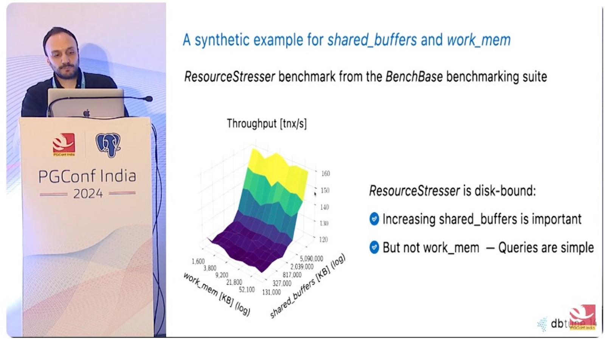
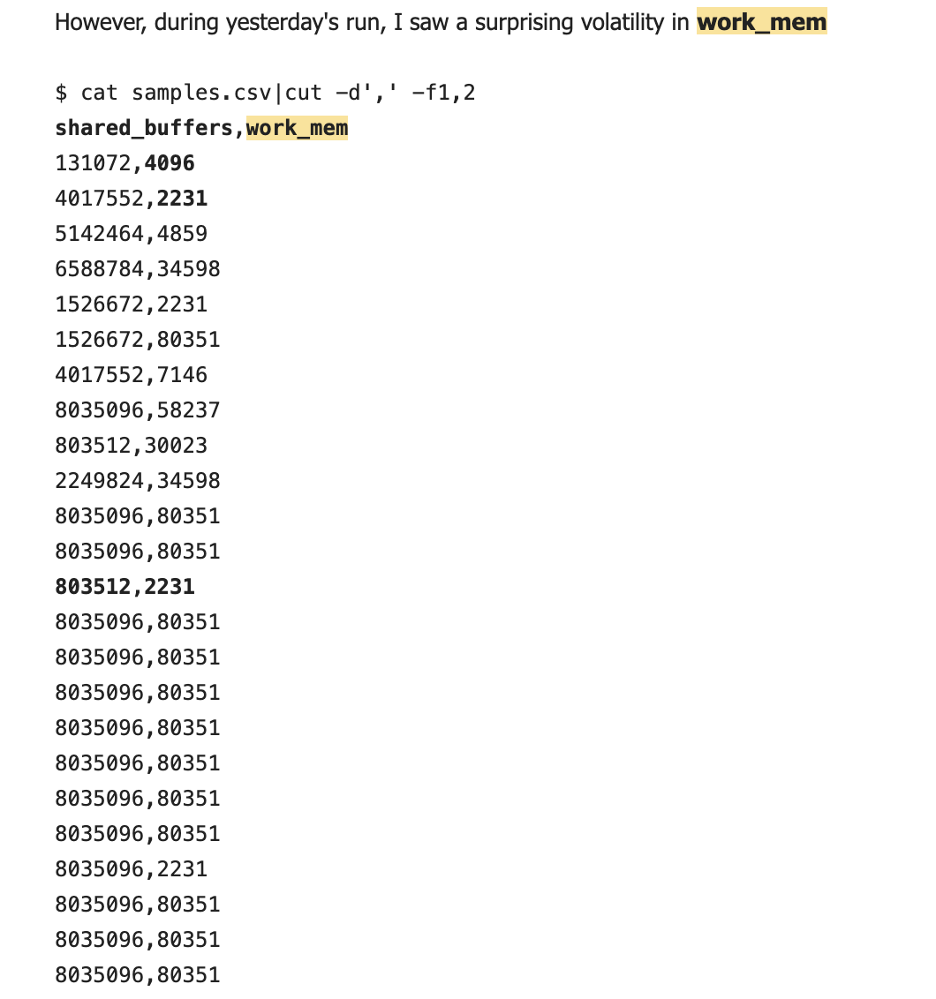
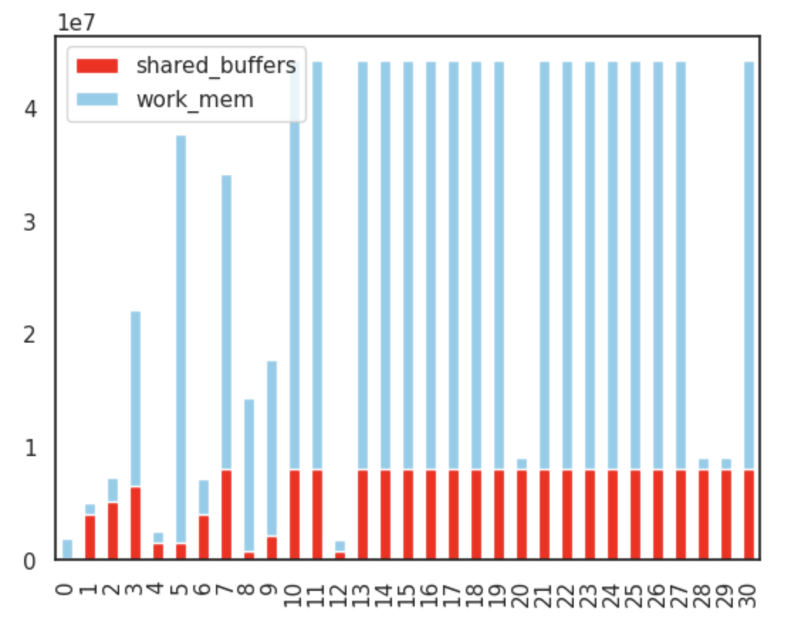
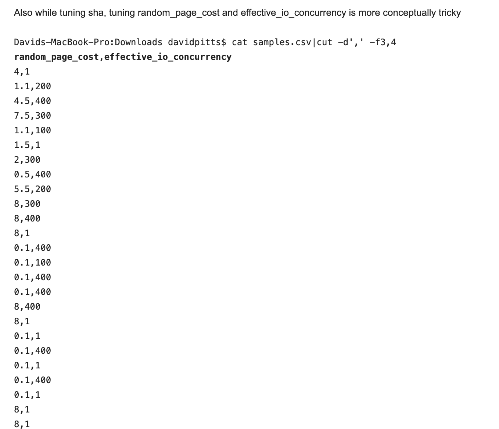

## Demo04 - DBtune test results and jupyter based analysis

### Background

These test results were based on 
* a 3 hour demo from DBtune working with Luigi (Nardi) and Mohsin (Ejaz)
* the workload is the BenchBase ResourceStresser (from Andy Pavlo CMU Database team)





### Analyzing DBtune 

I have attached [samples.csv](samples.csv)
```
pgday-munich-work_mem davidpitts$ head samples.csv|sed 's/,/\t\t/g'
shared_buffers		work_mem		random_page_cost		effective_io_concurrency		max_parallel_workers_per_gather		max_parallel_workers		max_wal_size		bgwriter_lru_maxpages		query_runtime		Valid		Timestamp
131072		4096		4		1		2		8		1048576		100		10.59044962621416		true		1711620803069
4017552		2231		1.1		200		2		4		4194304		100		2.852840267346968		true		1711620803069
...
```

after a bit of manual hacking around to get the long column names to match with the respective columns:
```
shared_buffers	             effective_io_concurrency	 max_wal_size                            Valid		Timestamp
       work_mem                 max_parallel_workers_per_gather	bgwriter_lru_maxpages
             random_page_cost             max_parallel_workers             query_runtime                                                                       
131072		4096		4		1		2		8		1048576		100		10.59044962621416		true		1711620803069
4017552		2231		1.1		200		2		4		4194304		100		2.852840267346968		true		1711620803069
5142464		4859		4.5		400		3		6		20971520		100		3.191442398622947		true		1711620803069
6588784		34598		7.5		300		3		4		8388608		200		3.0237229237469325		true		1711620803069
1526672		2231		1.1		100		2		8		8388608		100		3.5550100575032975		true		1711620803069
1526672		80351		1.5		1		0		6		25165824		500		2.8222562500160038		true		1711620803069
4017552		7146		2		300		2		8		4194304		500		3.211164901639214		true		1711620803069
8035096		58237		0.5		400		2		2		4194304		400		2.2983520308446264		true		1711620803069
803512		30023		5.5		200		3		8		16777216		100		3.6137225571900373		true		1711620803069
2249824		34598		8		300		0		0		8388608		100		3.342183290750861		true		1711620803069
8035096		80351		8		400		0		0		33554432		500		1.9939741319705255		true		1711621144048
8035096		80351		8		1		4		4		33554432		100		2.9316419291978977		true		1711621519964
803512		2231		0.1		400		0		0		33554432		500		2.9228140119642187		true		1711621894897
8035096		80351		0.1		100		4		4		4194304		500		2.605224390171068		true		1711622227442
8035096		80351		0.1		400		0		8		33554432		500		2.105606185218957		true		1711622598731
8035096		80351		0.1		400		0		0		25165824		500		2.5328117254222366		true		1711622972878
8035096		80351		8		400		0		8		33554432		500		2.904949061852017		true		1711623347436
8035096		80351		8		1		0		0		4194304		100		2.665781043794597		true		1711623720377
8035096		80351		0.1		1		0		0		33554432		500		2.0154160602364075		true		1711624094757
8035096		80351		0.1		400		0		0		33554432		100		2.7985417891824538		true		1711624468300
8035096		2231		0.1		1		0		0		33554432		500		3.022794644858784		true		1711624844239
8035096		80351		0.1		400		4		4		33554432		500		2.968680953477529		true		1711625217473
8035096		80351		0.1		1		0		0		8388608		500		2.6881642863225523		true		1711625590832
8035096		80351		8		1		0		0		16777216		500		1.9464676175267084		true		1711625963672
8035096		80351		8		1		0		0		20971520		500		2.3867104876419565		true		1711626339339
8035096		80351		0.1		400		0		0		16777216		500		2.401852734216208		true		1711626715727
8035096		80351		8		1		0		8		16777216		500		2.2541659369502343		true		1711627092712
8035096		80351		0.1		1		0		0		16777216		100		2.452535902336777		true		1711627467710
8035096		2231		8		1		0		0		16777216		500		2.222743528689838		true		1711627844116
8035096		2231		0.1		1		0		0		4194304		500		2.425892063922824		true		1711628218630
8035096		80351		8		400		0		0		16777216		500		2.301060899308272		true		1711628590602
```


### focus on core memory management - shared_buffers and work_mem

While I'm very curious about in ML, this is something I would still tune manually



Next loading this data into a jupyter notebook
```
import matplotlib.pyplot as plt
import seaborn as sns
import numpy as np

sns.set_style("white")

d = { 'shared_buffers': [  131072,4017552,5142464,6588784,1526672,1526672,4017552,8035096,803512,2249824,8035096,8035096,803512,8035096,8035096,8035096,8035096,8035096,8035096,8035096,8035096,8035096,8035096,8035096,8035096,8035096,8035096,8035096,8035096,8035096,8035096   ], 
       'work_mem':  [1843200,1003950,2186550,15569100,1003950,36157950,3215700,26206650,13510350,15569100,36157950,36157950,1003950,36157950,36157950,36157950,36157950,36157950,36157950,36157950,1003950,36157950,36157950,36157950,36157950,36157950,36157950,36157950,1003950,1003950,36157950]} 

df = pd.DataFrame(data=d)
df.plot(kind='bar', stacked=True, color=['red', 'skyblue', 'green'])
```

generates this nice graphic




### What about tuning random_page_cost and effective_io_concurrency - maybe a good job for ML

These sorts of parameters can be tricky to tune and vary with underlying storage infra (e.g. local SSDs, NFS, EBS, SAN, NAS ...)




